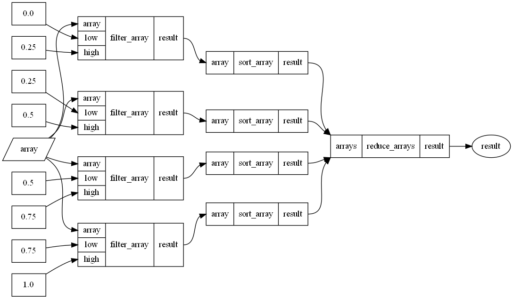
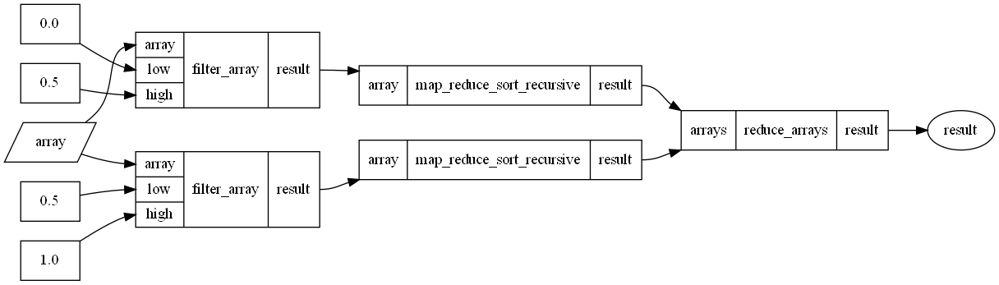

<div align="center">
  <a href="https://github.com/finos">
    
  </a>

  <h3 align="center">OpenGRIS Pargraph</h3>

  <p align="center">
    An efficient, lightweight, and reliable distributed computation engine.
  </p>

  <p align="center">
    <a href="https://community.finos.org/docs/governance/Software-Projects/stages/incubating">
      
    </a>
    <a href="https://citi.github.io/pargraph/">
      
    </a>
    <a href="./LICENSE">
        
    </a>
    <a href="https://pypi.org/project/pargraph/">
      
    </a>
    
  </p>
</div>

<br />

**OpenGRIS Pargraph is a lightweight parallel graph computation library for Python**.

Pargraph consists of two modules: a graph creation tool and an embedded graph scheduler. You can use either or both modules in your code.

## Installation

### Install Pargraph via pip

```bash
pip install pargraph
```

If you want to use GraphBLAS for better graph scheduling performance, you may install the optional `graphblas` extra:

```bash
pip install pargraph[graphblas]
```

## Graph creation

Pargraph provides a simple graph creation tool that allows you to build task graphs by decorating ordinary Python functions.

Pargraph has two decorators:

- `@delayed`: Decorate a function to make it delayed. Delayed functions are pure, inseperable functions that form the nodes of the computation graph and can be computed in parallel.
- `@graph`: Make a function in to a graph. These functions may call `@delayed` or other `@graph` functions.

### Example

```python
import numpy as np
from pargraph import graph, delayed


@delayed
def filter_array(array: np.ndarray, low: float, high: float) -> np.ndarray:
    return array[(array >= low) & (array <= high)]


@delayed
def sort_array(array: np.ndarray) -> np.ndarray:
    return np.sort(array)


@delayed
def reduce_arrays(*arrays: np.ndarray) -> np.ndarray:
    return np.concatenate(arrays)


@graph
def map_reduce_sort(array: np.ndarray, partition_count: int) -> np.ndarray:
    return reduce_arrays(
        *(
            sort_array(filter_array(array, i / partition_count, (i + 1) / partition_count))
            for i in range(partition_count)
        )
    )
```

The `map_reduce_sort()` function behaves like a normal Python function if called with concrete arguments.

```python
import numpy as np

map_reduce_sort(np.random.rand(20))

# [0.06253707 0.06795382 0.11492823 0.14512393 0.20183152 0.41109117
#  0.42613798 0.45156214 0.4714821  0.54000373 0.54902451 0.62671881
#  0.64402013 0.65147012 0.70903525 0.77846584 0.83861765 0.89170381
#  0.92492478 0.95370363]
```

But it can also be turned in to a graph using the `to_graph()` method. Here, we also use `.to_dot()` to generate a visual representation of the graph, and then `.write_png()` to save it to a file.

When we call `.to_graph()` we must provide arguments to the function that affect the topology of the graph. Here, `partition_count` will determine the number of times `sort_array()` and `filter_array()` are called, and thus affects the shape of the graph, therefore it must be provided when creating the graph. Any remaining arguments will be provided later when the graph is evaluated.

```python
map_reduce_sort.to_graph(partition_count=4).to_dot().write_png("map_reduce_sort.png")
```



Moreover, you can compose graph functions with other graph functions to generate ever more complex graphs. In this case we have a recursive graph function.

```python
@graph
def map_reduce_sort_recursive(
    array: np.ndarray, partition_counts: List[int], _low: float = 0, _high: float = 1
) -> np.ndarray:
    if len(partition_counts) == 0:
        return sort_array(array)

    partition_count, *partition_counts = partition_counts

    sorted_partitions = []
    for i in range(partition_count):
        low = _low + (_high - _low) * (i / partition_count)
        high = _low + (_high - _low) * ((i + 1) / partition_count)
        sorted_partitions.append(map_reduce_sort_recursive(filter_array(array, low, high), partition_counts, low, high))

    return reduce_arrays(*sorted_partitions)
```

```python
map_reduce_sort_recursive.to_graph(partition_counts=4).to_dot().write_png("map_reduce_sort_recursive.png")
```



Use the `to_dict()` method to convert the generated graph to a [task graph](https://docs.dask.org/en/latest/graphs.html).

When the task graph is created, all parameters must be known. Those which affect the shape of the graph are provided during graph creation to `to_graph()`, and we must provide the remaining arguments to `to_dict()`, except when parameters have defaults in which case they may be omitted. We are then yielded the task represented as a dictionary representing the computation, with argument values embedded.

```python
import numpy as np
from distributed import Client

with Client() as client:
    client.get(map_reduce_sort.to_graph(partition_count=4).to_dict(array=np.random.rand(20)))[0]

# [0.06253707 0.06795382 0.11492823 0.14512393 0.20183152 0.41109117
#  0.42613798 0.45156214 0.4714821  0.54000373 0.54902451 0.62671881
#  0.64402013 0.65147012 0.70903525 0.77846584 0.83861765 0.89170381
#  0.92492478 0.95370363]
```

## Graph scheduler

Pargraph can parallelize graph execution on computation backends that may not support it natively.
Pargraph can function as a scheduler that orchestrates execution of a graph by submitting individual tasks to any given parallel backend.

Pargraph implements Dask's `get` API and supports the same task graph format used by Dask, making it a drop-in Dask replacement for applications that don't need a fully-fledged graph scheduler.

If installed, graph scheduling is powered by [GraphBLAS](https://graphblas.org), a high-performance sparse-matrix linear algebra library. It allows for better scheduling performance for large and complex graphs (e.g. graphs with 100k+ nodes) as compared to native Python implementations.

## Usage

### Initialize the graph engine

```python
from pargraph import GraphEngine

graph_engine = GraphEngine()
```

### Choose a parallel backend

If you want to use a parallel backend other than the default local multiprocessing backend, you may pass it into `GraphEngine`'s constructor.

#### Example with a dask backend

```python
from distributed import Client
from distributed.cfexecutor import ClientExecutor

dask_client = Client(...)
graph_engine = GraphEngine(ClientExecutor(dask_client))
```

#### Example with a custom backend

You may also implement your own parallel backend by creating a class that implements the `submit` method.

```python
from concurrent.futures import Future


class CustomBackend:
    def __init__(self):
        pass

    def submit(self, fn, /, *args, **kwargs) -> Future:
        future = Future()

        # in a real backend you would submit the function
        # to a worker thread, a remote machine, etc.
        future.set_result(fn(*args, **kwargs))
        return future


backend = CustomBackend()
graph_engine = GraphEngine(backend)
```

### Compute graph

Build the task graph and compute a key of your choice:

```python
def inc(i):
    return i + 1


def add(a, b):
    return a + b


graph = {
    "x": 1,
    "y": (inc, "x"),
    "z": (add, "y", 10)
}
graph_engine.get(graph, "z")  # 12
```

You may also compute multiple keys:

```python
graph_engine.get(graph, ["x", "y", "z"])  # [1, 2, 10]
```

## Contributing

Your contributions are at the core of making this a true open source project. Any contributions you make are **greatly appreciated**.

We welcome you to:

- Fix typos or touch up documentation
- Share your opinions on [existing issues](https://github.com/finos/opengris-pargraph/issues)
- Help expand and improve our library by [opening a new issue](https://github.com/finos/opengris-pargraph/issues/new)

Please review [functional contribution guidelines](./CONTRIBUTING.md) to get started 👍.

_NOTE:_ Commits and pull requests to FINOS repositories will only be accepted from those contributors with an active, executed Individual Contributor License Agreement (ICLA) with FINOS OR contributors who are covered under an existing and active Corporate Contribution License Agreement (CCLA) executed with FINOS. Commits from individuals not covered under an ICLA or CCLA will be flagged and blocked by the ([EasyCLA](https://community.finos.org/docs/governance/Software-Projects/easycla)) tool. Please note that some CCLAs require individuals/employees to be explicitly named on the CCLA.

*Need an ICLA? Unsure if you are covered under an existing CCLA? Email [help@finos.org](mailto:help@finos.org)*

_NOTE:_ Commits and pull requests to FINOS repositories will only be accepted from those contributors with an active, executed Individual Contributor License Agreement (ICLA) with FINOS OR contributors who are covered under an existing and active Corporate Contribution License Agreement (CCLA) executed with FINOS. Commits from individuals not covered under an ICLA or CCLA will be flagged and blocked by the ([EasyCLA](https://community.finos.org/docs/governance/Software-Projects/easycla)) tool. Please note that some CCLAs require individuals/employees to be explicitly named on the CCLA.

*Need an ICLA? Unsure if you are covered under an existing CCLA? Email [help@finos.org](mailto:help@finos.org)*

## Code of Conduct

Please see the FINOS [Community Code of Conduct](https://www.finos.org/code-of-conduct).

## License

Copyright 2023 Citigroup, Inc.

This project is distributed under the [Apache-2.0 License](https://www.apache.org/licenses/LICENSE-2.0). See
[`LICENSE`](./LICENSE) for more information.

SPDX-License-Identifier: [Apache-2.0](https://spdx.org/licenses/Apache-2.0).

## Contact

If you have a query or require support with this project, [raise an issue](https://github.com/finos/opengris-pargraph/issues). Otherwise, reach out to [opensource@citi.com](mailto:opensource@citi.com).